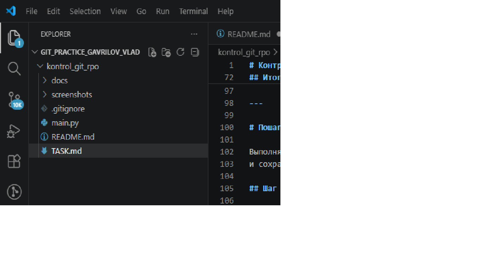
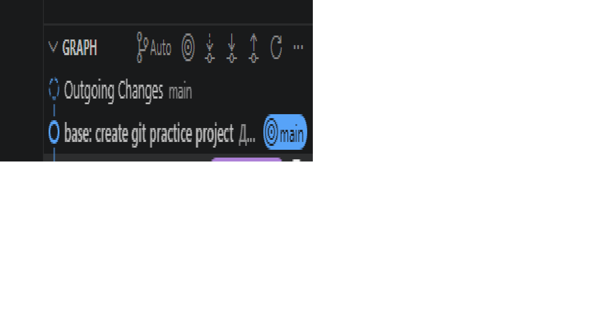
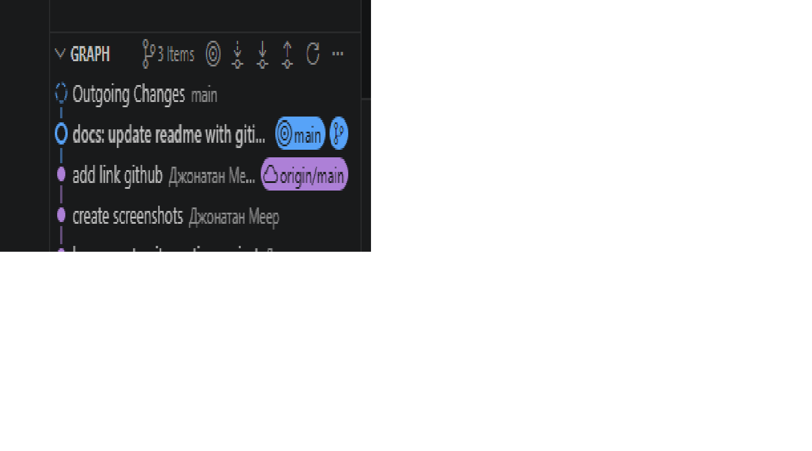

<!--
Это ШАБЛОН ОТЧЁТА. Заполните его своими данными по ходу работы.
Само задание со всеми шагами находится в файле TASK.md — его менять не нужно.
Заменяйте текст в [квадратных скобках] своими данными и удаляйте подсказки в <!-- ... -->.
-->

# Git Practice: Gavrilov Vladislav

Учебный проект для закрепления Git, GitHub и VS Code: README.md, .gitignore,
коммиты, ветки, merge, fetch, pull и разрешение конфликтов.

> Инструкция к работе — в файле [TASK.md](TASK.md).

## Информация о студенте

| Поле             | Значение                                |
|------------------|-----------------------------------------|
| ФИО              | Гаврилов Влад                           |
| Группа           | РПО/1                                   |
| Дисциплина       | Git и GitHub                            |
| Дата выполнения  | 17.06.2026                              |
| Ссылка на GitHub | https://github.com/skyblack94143-web/git_practice_gavrilov_rpo1.git|

## Цель работы

Закрепить полный цикл работы с Git и GitHub через графический интерфейс VS Code.

## Описание выполненных этапов

1. Клонировал шаблон проекта из GitHub.
2. Проверил Git-репозиторий.
3. Создал файлы README.md, .gitignore, main.py, docs/notes.md.
4. Настроил .gitignore (.env, venv/, __pycache__/, *.log не попадают в Git).
5. Сделал несколько осмысленных коммитов через Source Control.
6. Опубликовал репозиторий на GitHub через Publish Branch.
7. Создал ветку feature/readme-update.
8. Внёс изменения в ветке и сделал коммит.
9. Слил ветку в main через Merge.
10. Выполнил Fetch и Pull, увидел разницу.
11. Создал и разрешил конфликт в README.md.
12. Оформил README.md как отчёт со скриншотами.

## Использованные Git-действия

- Clone Repository
- Initialize Repository
- Stage Changes
- Commit
- Publish Branch
- Push / Sync Changes
- Fetch
- Pull
- Create Branch / Switch Branch
- Merge
- Resolve Conflict
- Git Graph

## Таблица Git-действий и их смысла

| Действие              | Где в VS Code                     | Смысл                                                   |
|-----------------------|-----------------------------------|---------------------------------------------------------|
| Clone Repository      | Command Palette → `Git: Clone`    | Копирует репозиторий с GitHub на компьютер              |
| Initialize Repository | Source Control                    | Создаёт локальный Git-репозиторий                       |
| Stage Changes         | Source Control, кнопка `+`         | Подготавливает файлы к коммиту                          |
| Commit                | Поле `Message` + кнопка `Commit`  | Сохраняет версию проекта в истории                      |
| Publish Branch        | Source Control                    | Публикует проект/ветку на GitHub                        |
| Push / Sync Changes   | Source Control                    | Отправляет и синхронизирует коммиты с GitHub            |
| Fetch                 | Source Control → `...` → `Fetch`  | Проверяет изменения на GitHub, не меняя локальные файлы |
| Pull                  | Source Control → `...` → `Pull`   | Загружает и применяет изменения с GitHub                |
| Create / Switch Branch| Панель снизу слева, Git Graph     | Создаёт и переключает ветки                             |
| Merge                 | Git Graph / Command Palette       | Объединяет изменения одной ветки с другой               |
| Resolve Conflict      | Редактор VS Code                  | Выбор или объединение конфликтующих изменений           |
| Git Graph             | Расширение Git Graph              | Показывает историю коммитов и веток                     |

## Разница между Fetch и Pull

git fetch загружает все новые данные из удаленного репозитория в локальный — без изменения файлов в рабочей директории. Изменения сохраняются в специальных «отслеживающих» ветках, например origin/main.

git pull автоматически выполняет две операции подряд:

git fetch — загружает обновления.
git merge — сливает загруженные изменения с текущей локальной веткой.

## Конфликт и его решение

Мы клонировали репозиторий, изменили строку в README.md, сделали коммит изменения.
Открыли README.md на GitHub и сделали изменение той же строки и закоммитили прямо на GitHub.
Вернулись в VS Code и сделали pull, Git нашел конфликт и поставил маркеры.
Открыли конфликт в VS Code и нам были даны несколько вариантов: Accept Current Change — оставить локальную версию; Accept Incoming Change — взять удалённую версию; Accept Both Changes — объединить обе версии; Manual Edit — отредактировать вручную. Выбираем Accept Both Changes, удаляем все маркеры и сохраняем файл.
Добавили файл в индекс сделали коммит разрешения конфликта, отправили изменения на GitHub.

## Скриншоты выполнения работы

### 1. Созданный проект в VS Code

### 2. Инициализированный репозиторий

### 3. Первый коммит

### 4. Репозиторий на GitHub

### 5. Созданная ветка

### 6. Результат merge

### 7. Выполнение Fetch / Pull

### 8. Итоговая история в Git Graph

## Вывод

- `.gitignore` помогает не отправлять в GitHub временные и секретные файлы.
- Файл `.env` нельзя публиковать, потому что в нём могут быть токены и пароли.
- Перед коммитом нужно проверять Source Control.
- Нужно делать несколько коммитов, чтобы можно было отслеживать изменения
- Нужно делать коммиты с понятными и обдуманными названиями